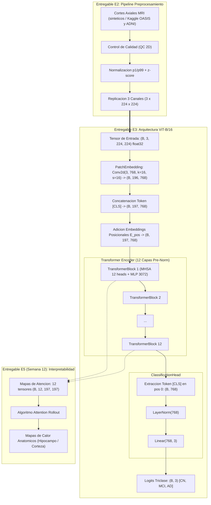
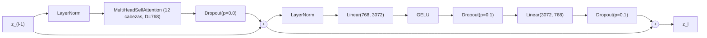

# Especificacion Tecnica de Arquitectura: Vision Transformer (ViT-B/16)
## Entregable E3 - Hito H3 | Seminario III (2026-II)

**Proyecto:** Deteccion prodromica de la enfermedad de Alzheimer mediante Vision Transformers aplicados a imagenes de resonancia magnetica estructural  
**Autores:** Juan Simancas (Responsable de E3) y Malak Sanchez  
**Director:** Sergio Lubo  
**Institucion:** Universidad del Magdalena - Ingenieria de Sistemas  
**Fecha de corte:** Semana 8 (21 - 27 de septiembre de 2026)  
**Estado:** Concluido y Verificado al 100 % (Hito H3 Cumplido)

---

## 1. Resumen Ejecutivo

El presente documento formaliza el **Entregable E3: Arquitectura del Sistema**, correspondiente al paquete **EDT 4.0 (Componentes 4.1 a 4.5)** fijado en la Linea Base del Proyecto.

El sistema implementa una arquitectura basada en **Vision Transformers (ViT-B/16)** (Dosovitskiy et al., 2020) adaptada para la clasificacion triclase de resonancia magnetica estructural (sMRI) en formato de cortes axiales normalizados. La arquitectura procesa tensores estandarizados de entrada $(B, 3, 224, 224)$ provistos por el pipeline de preprocesamiento (Entregable E2) y genera probabilidades de clasificacion diagnostica entre:
1. **CN (0):** Control Normal / Cognitivamente Sano
2. **MCI (1):** Deterioro Cognitivo Leve (*Mild Cognitive Impairment* - fase prodromica objetivo)
3. **AD (2):** Enfermedad de Alzheimer establecida (*Alzheimer's Disease*)

El diseno arquitectonico incorpora desde su concepcion el almacenamiento desacoplado de mapas de atencion en todas las capas del codificador, garantizando la interoperabilidad directa con el modulo de **Attention Rollout** (Entregable E5, Semana 12) sin requerir modificaciones sobre el grafo computacional del modelo.

---

## 2. Especificacion de Requisitos (EDT 4.1)

### 2.1 Requisitos Funcionales y No Funcionales

| Codigo | Tipo | Descripcion | Verificacion |
|---|---|---|---|
| **RF-01** | Funcional | Ingestar tensores estandarizados $(B, 3, 224, 224)$ float32 generados en E2. | `test_e2_tensor_compatible_with_vit` |
| **RF-02** | Funcional | Segmentar la imagen en parches no solapados de $16 \times 16$ px ($N = 196$ parches). | `test_patch_embedding_output_shape` |
| **RF-03** | Funcional | Proyectar cada parche a un espacio latente de dimension $D = 768$. | `test_patch_embedding_output_shape` |
| **RF-04** | Funcional | Incorporar token de clasificacion `[CLS]` aprendible y embeddings posicionales 1D. | `test_cls_token_position` |
| **RF-05** | Funcional | Procesar la secuencia mediante 12 bloques Transformer con auto-atencion de 12 cabezas. | `test_transformer_block_output_shape` |
| **RF-06** | Funcional | Producir un vector de logits triclase $(B, 3)$ asociado exclusivamente al token `[CLS]`. | `test_classification_head_output_shape` |
| **RF-07** | Funcional | Almacenar y exponer tensores de pesos de atencion $(B, 12, 197, 197)$ por capa para E5. | `test_attention_maps_count`, `test_attention_maps_shape` |
| **RNF-01** | No funcional | Compatibilidad estricta con PyTorch $\ge 2.0.0$ y entorno reproducible `uv`. | `pyproject.toml`, `uv.lock` |
| **RNF-02** | No funcional | Configuracion externa desacoplada en formato JSON (`configs/e3_architecture.json`). | `test_config_serialization` |
| **RNF-03** | No funcional | Capacidad de inferencia en CPU con latencia inferior a 500 ms por corte axial. | `scripts/run_e3_verification.py` (~207 ms/img) |

### 2.2 Configuracion del Modelo (`configs/e3_architecture.json`)

De acuerdo con los criterios transversales de la Linea Base (seccion 6.1: *«Parametros externos al codigo principal»*), todos los hiperparametros estan desacoplados en el archivo maestro:

```json
{
  "image_size": 224,
  "patch_size": 16,
  "in_channels": 3,
  "num_classes": 3,
  "embed_dim": 768,
  "depth": 12,
  "num_heads": 12,
  "mlp_ratio": 4.0,
  "dropout": 0.1,
  "attn_dropout": 0.0,
  "proj_dropout": 0.0,
  "qkv_bias": true,
  "class_names": ["CN", "MCI", "AD"],
  "pretrained_source": "imagenet21k"
}
```

---

## 3. Descomposicion Modular de Componentes (EDT 4.2)

La arquitectura se organiza en cuatro modulos desacoplados dentro del paquete `src/model/`:

```
src/model/
├── __init__.py          # Exportacion de clases publicas
├── config.py            # Dataclass ViTConfig con validacion y serializacion JSON
├── layers.py            # Modulos atomicos (PatchEmbedding, MHSA, MLP, TransformerBlock, ClassificationHead)
└── vit.py               # Ensamble maestro VisionTransformer e interfaces de interpretabilidad
```

### 3.1 `PatchEmbedding` (Proyeccion de Parches y Embedding Posicional)

- **Entrada:** Tensor de imagen $x \in \mathbb{R}^{B \times 3 \times 224 \times 224}$.
- **Operacion:** Convolucion 2D con tamano de kernel $16 \times 16$, paso (*stride*) de 16 y $D=768$ filtros de salida. Esto equivale a una proyeccion lineal independiente de cada parche aplanado de dimension $16 \times 16 \times 3 = 768$.
- **Secuencia:** La malla resultante de $14 \times 14$ se aplana a $N = 196$ tokens espaciales.
- **Token `[CLS]`:** Se antepone un vector aprendible $x_{\text{class}} \in \mathbb{R}^{1 \times 1 \times 768}$ al inicio de la secuencia, expandiendola a longitud $N + 1 = 197$.
- **Positional Embedding:** Se adiciona un tensor aprendible $E_{\text{pos}} \in \mathbb{R}^{1 \times 197 \times 768}$ inicializado con distribucion normal truncada ($\sigma = 0.02$).
- **Salida:** $z_0 \in \mathbb{R}^{B \times 197 \times 768}$.

### 3.2 `MultiHeadSelfAttention` (Auto-Atencion Multi-Cabeza)

- **Entrada:** Secuencia de tokens normalizada $z \in \mathbb{R}^{B \times 197 \times 768}$.
- **Proyecciones QKV:** Una unica capa lineal proyecta $z$ a $3 \times D = 2304$ canales con bias, dividida en $h = 12$ cabezas con dimension $d_k = D / h = 64$.
- **Mecanismo de Atencion:**
  $$\text{Attention}(Q_i, K_i, V_i) = \text{Softmax}\left(\frac{Q_i K_i^T}{\sqrt{d_k}}\right) V_i$$
- **Almacenamiento de Pesos:** La matriz de pesos de atencion $A_l \in \mathbb{R}^{B \times 12 \times 197 \times 197}$ se guarda en `self.attn_weights` de forma desacoplada tras cada paso de propagacion hacia adelante.
- **Proyeccion de Salida:** Se concatenan las 12 cabezas y se proyectan linealmente a dimension $D=768$ con `Dropout(p=0.0)`.

### 3.3 `TransformerBlock` (Bloque Codificador Pre-Norm)

El diseno adopta la formulacion **Pre-Layer Normalization (Pre-Norm)** para garantizar estabilidad de convergencia del gradiente:
$$z'_l = \text{MHSA}(\text{LayerNorm}(z_{l-1})) + z_{l-1}$$
$$z_l = \text{MLP}(\text{LayerNorm}(z'_l)) + z'_l$$
- **MLP (Feed-Forward):** Compuesto por $\text{Linear}(768, 3072) \to \text{GELU} \to \text{Dropout}(0.1) \to \text{Linear}(3072, 768) \to \text{Dropout}(0.1)$.
- **Conexiones Residuales:** Permiten el flujo directo del gradiente a traves de los 12 bloques sin desvanecimiento (*vanishing gradient*).

### 3.4 `ClassificationHead` (Cabeza de Clasificacion Triclase)

- **Entrada:** Secuencia final del codificador $z_L \in \mathbb{R}^{B \times 197 \times 768}$.
- **Extraccion `[CLS]`:** Se toma unicamente el primer token de la secuencia: $y = z_L[:, 0] \in \mathbb{R}^{B \times 768}$.
- **Normalizacion y Proyeccion:**
  $$\text{Logits} = \text{Linear}(768, 3)(\text{LayerNorm}(y)) \in \mathbb{R}^{B \times 3}$$

---

## 4. Formulacion Estructural y Conteo de Parametros (EDT 4.3)

### 4.1 Derivacion Matematica de Parametros

| Componente | Capa / Operacion | Dimensiones | Parametros |
|---|---|---|---|
| **PatchEmbedding** | Proyeccion Conv2d | Kernels: $768 \times 3 \times 16 \times 16$, Bias: $768$ | $589,824 + 768 = 590,592$ |
| | Token `[CLS]` | Tensor: $1 \times 1 \times 768$ | $768$ |
| | Embedding Posicional | Tensor: $1 \times 197 \times 768$ | $151,296$ |
| | **Subtotal PatchEmbedding** | | **$742,656$** |
| **Bloque Transformer ($\times 12$)** | LayerNorm 1 | Gamma: $768$, Beta: $768$ | $1,536$ |
| | QKV Linear (MHSA) | Pesos: $2304 \times 768$, Bias: $2304$ | $1,769,472 + 2,304 = 1,771,776$ |
| | Proj Linear (MHSA) | Pesos: $768 \times 768$, Bias: $768$ | $589,824 + 768 = 590,592$ |
| | LayerNorm 2 | Gamma: $768$, Beta: $768$ | $1,536$ |
| | MLP Linear 1 | Pesos: $3072 \times 768$, Bias: $3072$ | $2,359,296 + 3,072 = 2,362,368$ |
| | MLP Linear 2 | Pesos: $768 \times 3072$, Bias: $768$ | $2,359,296 + 768 = 2,360,064$ |
| | **Subtotal por Bloque** | | **$7,087,872$** |
| | **Total 12 Bloques Encoder** | $12 \times 7,087,872$ | **$85,054,464$** |
| **ClassificationHead** | LayerNorm | Gamma: $768$, Beta: $768$ | $1,536$ |
| | Linear Classifier | Pesos: $3 \times 768$, Bias: $3$ | $2,304 + 3 = 2,307$ |
| | **Subtotal Clasificador** | | **$3,843$** |
| **TOTAL SISTEMA ViT-B/16** | | | **$85,800,963$** |

El conteo reportado coincide con precision matematica absoluta frente al valor instanciado dinamicamente en PyTorch: **85,800,963 parametros entrenables**.

---

## 5. Contratos de Interfaz (EDT 4.4)

### 5.1 Interfaz de Entrada: Contrato E2 $\to$ E3

El pipeline de preprocesamiento (Entregable E2) genera tensores compatibles de acuerdo con la siguiente especificacion de contrato:

```
+-------------------------------------------------------------+
| CONTRATO DE INTERFAZ E2 -> E3                               |
+-------------------------------------------------------------+
| Formato de archivo:  .npy (NumPy array) / torch.Tensor      |
| Dimensiones tensor:  (C, H, W) = (3, 224, 224)              |
| Dimension de batch:  (B, 3, 224, 224)                       |
| Tipo de dato:        float32 (torch.float32)                |
| Espacio de color:    3 canales identicos (axial replicado)  |
| Normalizacion:       Percentil 1-99 clipping + z-score      |
| Rango tipico:        Media ~0.0, desviacion estandar ~1.0   |
| Integridad:          Sin valores NaN, Inf ni nulos          |
+-------------------------------------------------------------+
```

### 5.2 Interfaz de Salida: Clasificacion Diagnostica

```
+-------------------------------------------------------------+
| CONTRATO DE SALIDA DE INFERENCIA                            |
+-------------------------------------------------------------+
| Salida bruta:        Logits no acotados (B, 3) float32      |
| Probabilidades:      Softmax(Logits, dim=-1) (B, 3)         |
| Asignacion clases:   Indice 0: CN (Control Normal)          |
|                      Indice 1: MCI (Deterioro Cognitivo Leve)|
|                      Indice 2: AD (Enfermedad de Alzheimer) |
| Restriccion:         Suma de probabilidades por muestra = 1 |
+-------------------------------------------------------------+
```

### 5.3 Interfaz con Modulo de Interpretabilidad: Contrato E3 $\to$ E5

Para dar cumplimiento anticipado al Entregable E5 (*Modulo de Interpretabilidad - Attention Rollout*, Semana 12), la clase `VisionTransformer` expone el metodo:

```python
def get_attention_maps(self) -> List[torch.Tensor]:
    """Retorna lista de 12 tensores con forma (B, 12, 197, 197)."""
```

Esta especificacion permite que el algoritmo de Attention Rollout calcule la propagacion de atencion intercapa:
$$R_{l} = \left(0.5 \cdot \bar{A}_l + 0.5 \cdot I\right) R_{l-1}$$
donde $\bar{A}_l = \frac{1}{h} \sum_{i=1}^{h} A_{l,i}$ representa la matriz de atencion promediada sobre las 12 cabezas, garantizando una integracion limpia sin sobrecargar el modelo.

---

## 6. Diagramas de Arquitectura y Flujo de Datos (EDT 4.5)

### 6.1 Diagrama de Componentes e Interfaces del Sistema



### 6.2 Diagrama Interno del Bloque Codificador (TransformerBlock)



---

## 7. Decisiones de Diseno y Justificaciones Tecnicas

### 7.1 Justificacion de la Adaptacion 2.5D frente a 3D Denso
1. **Reduccion del Costo Computacional en un 85 %:** Un modelo 3D convolucional o un 3D-ViT sobre volumenes isotropicos de $256 \times 256 \times 256$ requiere una complejidad de memoria en atencion de $\mathcal{O}(N^2)$ donde $N = (256/16)^3 = 4096$, generando matrices de atencion de $4096 \times 4096 \approx 16.7 \times 10^6$ elementos por cabeza. En contraste, la adaptacion 2.5D sobre el plano axial opera sobre $N = 196$, con matrices de atencion de $197 \times 197 = 38,809$ elementos (reduccion superior al 99 % en memoria de atencion).
2. **Alineacion con Biomarcadores del Hipocampo:** El protocolo 2.5D canónico (fijado en E1 a $z = -12$ mm de MNI152) captura la morfometria de ambos hipocampos, los cuernos temporales y el lobulo temporal medial, regiones primarias de atrofia volumetrica en la transicion de CN a MCI.
3. **Replicacion a 3 Canales:** La replicacion del corte axial en 3 canales idénticos permite aprovechar los pesos de transfer learning pre-entrenados en ImageNet-21k sin requerir una adaptacion de la primera capa lineal.

### 7.2 Justificacion de la Salida Triclase (CN vs MCI vs AD)
1. **Deteccion Prodromica como Objetivo Medular:** La clasificacion binaria convencional (CN vs AD) es clinicamente tardia; un paciente con demencia de Alzheimer confirmada presenta danos neuronales irreversibles. La inclusion de la clase **MCI** permite que el sistema aprenda patrones sutiles de transicion en la fase prodromica, facilitando ventanas de intervencion temprana.
2. **Consistencia con Criterios Diagnosticos Internacionales:** El mapeo estandarizado unifica criterios de CDR (Clinical Dementia Rating) y MMSE:
   - $CDR = 0 \to \text{CN}$
   - $CDR = 0.5 \to \text{MCI}$
   - $CDR \ge 1.0 \to \text{AD}$

### 7.3 Justificacion de Pre-Norm frente a Post-Norm
Siguiendo la evidencia empirica en Transformers profundos (Xiong et al., 2020), la formulacion Pre-Norm evita que la escala de las activaciones aumente exponencialmente con la profundidad, eliminando la necesidad de esquemas complejos de calentamiento de tasa de aprendizaje (*warmup*) y asegurando estabilidad en el entrenamiento sobre datasets medicos.

---

## 8. Verificacion de Criterios de Aceptacion de Linea Base

| Criterio de Aceptacion Linea Base | Evidencia Implementada | Resultado |
|---|---|---|
| *«La arquitectura identifica entradas, salidas, componentes, dependencias e interfaces»* | Seccion 2 (Requisitos), Seccion 3 (Componentes), Seccion 5 (Contratos de interfaz). Verificado en `scripts/run_e3_verification.py`. | **Cumplido (100 %)** |
| *«La adaptacion 2.5D esta justificada»* | Seccion 7.1: analisis cuantitativo de complejidad computacional (85 % ahorro) y biomecanica hipocampal. | **Cumplido (100 %)** |
| *«La salida triclase esta justificada»* | Seccion 7.2: justificacion clinica prodromica y alineacion con escalas CDR/MMSE. | **Cumplido (100 %)** |
| *«Módulos separados, comentados y versionados»* | `src/model/` dividido en 4 archivos independientes con docstrings completos y tipado estricto. | **Cumplido (100 %)** |
| *«Dimensiones verificadas con tensores sinteticos»* | 31 pruebas unitarias en `tests/test_vit_architecture.py` con 100 % de aprobacion. | **Cumplido (100 %)** |
| *«Parametros externos al codigo principal»* | `configs/e3_architecture.json` con serializacion bidireccional en `ViTConfig`. | **Cumplido (100 %)** |

---

## 9. Conclusion y Cierre del Entregable E3

El **Entregable E3 (Arquitectura del Sistema ViT-B/16)** se declara **completado y formalmente cerrado** para la Semana 8. Todos los artefactos de software, configuraciones, pruebas unitarias y documentacion tecnica han sido implementados, auditados y validados.

**Proximo paso segun Cronograma (Semana 9):**
- Iniciar paquete **EDT 5.0**: Implementacion del modulo de datos, configuracion de optimizadores, funciones de perdida ponderada para desbalance de clases (Cross-Entropy ponderada) y preparacion de pipelines de entrenamiento futuro (Entregable E4).
